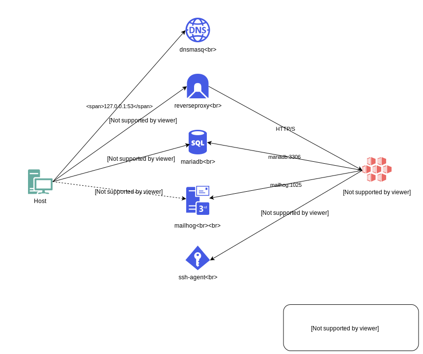

# dde (Docker based Development Environment)

Local development environment toolset based on Docker supporting multiple projects.

Features include:

* Simplified Docker web application development
* Installation of system wide services:
    * `*.test` domain lookup based on [dnsmasq](http://www.thekelleys.org.uk/dnsmasq/doc.html)
    * Reverse Proxy based on [jwilder/nginx-proxy](https://github.com/jwilder/nginx-proxy) to run multiple projects on same port (80/443) with autoconfigured SSL certificates
    * [MariaDB](https://mariadb.org/) ([MySQL](https://www.mysql.com/) alternative)
    * [MailCrab](https://github.com/tweedegolf/mailcrab) (SMTP testing server)
    * [ssh-agent](https://www.ssh.com/ssh/agent) used for sharing your SSH key without adding it to your project Docker containers.
* Choose you preferred file sharing
    * docker volume export
    * Performance optimized file sharing based on [docker-sync](http://docker-sync.io/) 
    * [Mutagen](https://mutagen.io/)

**Note:** dde is currently under heavy development and we don't offer any backward compatibility. However we use it at [whatwedo](https://www.whatwedo.ch/) on daily bases and it's safe to use it in your development environment.


## Requirements

* macOS, Ubuntu or Windows (WSL 2)
* [Docker 17.09.0+](https://docs.docker.com/)
* [docker-compose 1.22+](https://docs.docker.com/compose/)
* [docker-sync 0.5+](http://docker-sync.io/) 
* [Mutagen v0.10.0+](https://mutagen.io/)
* [Bash](https://www.gnu.org/software/bash/)
* [openssl](https://www.openssl.org/)
* No other services listening localhost on:
    * Port 53
    * Port 80
    * Port 443
    * Port 3306


# Architecture




## Installation

```
cd ~
git clone https://github.com/whatwedo/dde.git
~/dde/dde.sh system:dde:install
~/dde/dde.sh system:up
```

`system:dde:install` modifies your .profile files based on your shell:

* autocompletion 
* aliases 

dde can now be used in a new shell, enjoy!

### Aliases
```
# if you're using bash
echo "alias dde='~/dde/dde.sh'" >> ~/.bash_profile

# if you're using zsh
echo "alias dde='~/dde/dde.sh'" >> ~/.zshrc
```

### Autocompletion

add `eval $(~/dde/dde.sh --autocomplete)`  to  `~/.zshrc` or `~/.bash_profile`  


### Additional OS specific installation steps


#### macOS

Forward requests for `.test`-domains to the local DNS resolver:

```
sudo mkdir -p /etc/resolver
echo -e "nameserver 127.0.0.1" | sudo tee /etc/resolver/test
```

Trust the newly generated Root-CA for the self-signed certificates

```
sudo security add-trusted-cert -d -r trustRoot -k /Library/Keychains/System.keychain ~/dde/data/reverseproxy/etc/nginx/certs/ca.pem
```


#### Linux

Set your DNS to `127.0.0.1` with fallbacks of your choice.

Trust the newly generated Root-CA found here:

```
~/dde/data/reverseproxy/etc/nginx/certs/ca.pem
```

#### Windows (WSL 2)

Set your DNS to `127.0.0.1` with fallbacks of your choice.

1. In WSL-Terminal, adjust the file `/etc/wsl.conf` to

```
[network]
generateResolvConf = false
```

2. Remove the file / link `resolv.conf` and close the WSL-Terminal

3. To restart WSL, run in powershell (admin):

```
wsl --shutdown
Get-Service LxssManager | Restart-Service
```

4. Open a WSL-Terminal and create a file `/etc/resolv.conf` with the following content:

```
nameserver 127.0.0.1
nameserver 1.1.1.1
```

5. Restart WSL again (step #3)

## File-Sync

File-sync can be done by mutagen, docker-sync or by native docker volumes. 

### Mutagen

put the `mutagen.yml` file in the project root directory see [mutagen-example](example/with-mutagen).

In the `docker-compose.yml` the volume is not exposed.

### Docker-Sync

put the `docker-sync.yml` file in the project root directory see [docker-sync-example](example/with-dockersync).

In the `docker-compose.yml` the volume is not exposed.

### native Docker

define in your `docker-compose.yml` or `docker-compose.override.yml` the exposed volumes.

### override the sync Settings

If you have project where the file-sync done by mutagen or docker-sync. you are able to override
the setting in a `docker-compose.override.yml` file.

copy sample `docker-compose.override.yml`:

```
$ dde project:docker-override
```

this command copies [docker-compose.override.yml](example/docker-compose.override.yml) to your project directory.

edit the file. With the custom-tag  `x-dde-sync` you can now choose you preferred syncing mode. 

valid values are `docker-sync`, `mutagen` or `volume`

if you use `volume` you must expose the volume in the `docker-compose.override.yml` file. 

## Tip and Tricks

### Fix Permission

Services such as nginx in Docker containers normally runs with the `root` user. With the `dde exec` command
you login into the container with the user `dde`. If services writes files, ex. `var/cache`, `root` is the owner. 
On the host files also the `root` is the owner. In this case you normally not able to delete or change the files 
created by the services.

the [command](commands/project/fix-permissions.sh) `project:fix-permissions` resolve this issue by `chown dde:dde` 
in the container and `chown {yourLocalUser}:{yourLocalGroup}` in the local host.


### OPEN_URL & DDE_BROWSER

Add `OPEN_URL` in the `environment` array of your `docker-compose.yml`.

On the `project:up` or `project:open` command the website(s) will be opened in your standard browser.


```yaml
services:
    web:
        ...
        environment:
            - VIRTUAL_HOST=cloud.project.test
            - OPEN_URL=http://cloud.project.test/
    storage:
        ...
        environment:
            - VIRTUAL_HOST=minio.project.test
            - OPEN_URL=http://minio.project.test:9000/

```

Set the environment variable `DDE_BROWSER` if you what to start a specific browser.


`command/local.sh`
```bash
DDE_BROWSER=/usr/bin/firefox
```


## Additional Services

If you need additional central Services. eg. PostgresSQL just add then in `docker-compose.override.yml` in the 
dde-directory.

Available Services

- [PostgresSQL](services/postgres/docker-compose.override.yml)
- MySql
- Redis
- ....


## Usage

```
$ dde help
```

### Insparations

https://github.com/stylemistake/runner

https://github.com/nickjj/docker-flask-example

https://github.com/adriancooney/Taskfile


### Project configuration

Due to the early stage of this project there is no full documentation available. We created a [example](example) project with all required and optional configuration. Please checkout the [example](example) directory.


## Including custom command

you can include custom commands by adding them in the `commands/local/` directory. 
Custom commands must be prefixed with the `local:` namespace.

### Anatomy of a command

`commands\local\my_command.sh`
```bash
## inline help for local:my_command
#
# more help for the command
#
# this will be displayed with the --help argument on the command
#
# e.g dde local:command --help
#

function local:my_command() {
    echo 'execute local:my_command'
    _localCommand_someInternalFunction arg1
}

function _localCommand_someInternalFunction() {
    echo "do something with ${1}"
}
```

* script must be located in the `command` directory
* Help text for the commands
  * `:` will be replaced by `/` for locating the help script
  * the first line beginning with `##` is the help text displayed be the help command
  * all following lines beginning with `#` will displayed in the command help 
* you can add as many functions as you want in the script
* to avoid conflicts prefix internal functions 
* functions and can also be defined in the `command/local.sh` file
* the `command/local.sh` file is the last loaded source, so you are able to overwrite system variables
and functions there

`command/local.sh`
```bash
function _local_someGlobalHelperFunction() {
    echo "a global helper function"
}


# overwrite a variable
SYNC_MODE=volume


# overwrite a function/command
function project:env() {
    echo "my custom project env"
}


```

## Known solutions
* **failed to remove network dde**  
If you get this error it means your project `docker-compose.yml` is wrongly configured.
Be sure to mark the `dde` network as external, like in our examples:
```yml
networks:
    default:
        external: # <-- important
            name: "dde"
```

## Known problems

* Files of filesystem mapped with docker-sync will get group id `0`.

## Bugs and Issues

If you have any problems with this image, feel free to open a new issue in our issue tracker https://github.com/whatwedo/dde/issues


## License

This project is under the MIT license. See the complete license in the repository: [LICENSE](LICENSE)
