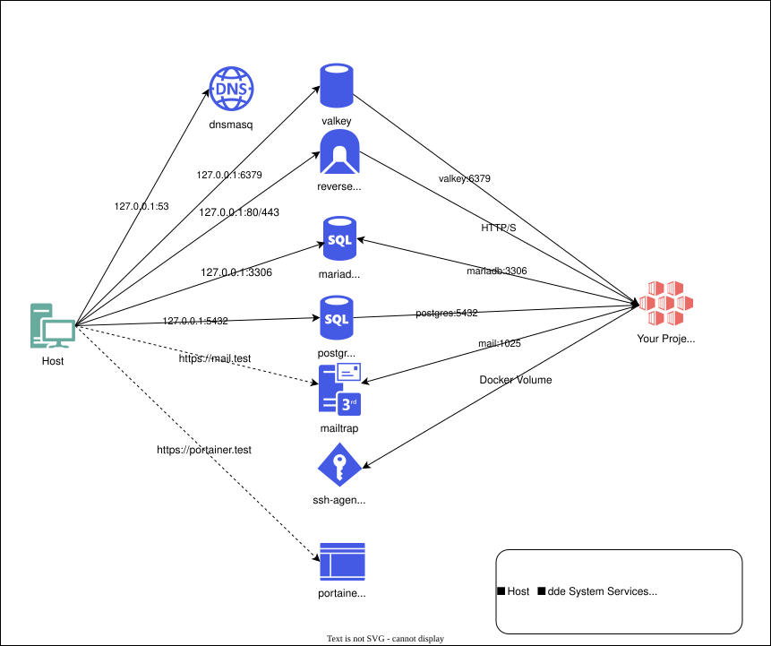

## System services vs. project containers



dde manages two layers of Docker containers:

**System services** are long-running, shared infrastructure containers managed by `system:install`. They run independently of any project and are shared across all projects on the machine:

- **Traefik** -- Reverse proxy on ports 80 and 443. Routes traffic to project containers based on labels.
- **dnsmasq** -- DNS server that resolves `*.test` domains to `127.0.0.1`. Forwards other queries to upstream DNS (default: `9.9.9.9`, `149.112.112.112`).
- **SSH agent** -- Holds SSH keys and makes them available to project containers via a shared volume.

**Project containers** are defined in your project's `docker-compose.yml` and started/stopped by `project:up` and `project:down`. These include your application container(s) and any per-project services (databases, caches, mail).

The supported per-project services are:

| Service   | Default version | Default port |
|-----------|----------------|-------------|
| MariaDB   | 11.8           | 3306        |
| PostgreSQL| 18.3           | 5432        |
| Valkey    | 9              | 6379        |
| Mailpit   | latest         | 8025        |

## Configuration hierarchy

dde resolves configuration values using a layered override chain. Values from higher layers take precedence:

```
CLI options (highest priority)
    |
Project config (.dde/config.yml)
    |
Global config (~/.dde/config.yml)
    |
Built-in defaults (lowest priority)
```

For example, the MariaDB version resolves as follows:

1. If `.dde/config.yml` specifies an explicit version for the mariadb service, that version is used.
2. Otherwise, if `~/.dde/config.yml` defines a global service version override, that version is used.
3. Otherwise, the built-in default (`11.8`) is used.

### Global config

Located at `~/.dde/config.yml`. Controls machine-wide defaults:

```yaml
output: text                        # Default output format (text or json)
dns:
  forward:
    - 9.9.9.9
    - 149.112.112.112
ssh:
  keys: []                          # SSH key paths to add to the agent
services:
  mariadb:
    version: "11.8"
  postgres:
    version: "18.3"
```

### Project config

Located at `.dde/config.yml` inside the project root. Controls per-project settings:

```yaml
name: my-app
services:
  - name: mariadb
    version: "11.8"
  - name: valkey
containers:
  web:
    shell: /bin/bash
```

## The .dde/ directory

`project:init` creates a `.dde/` directory in your project root with the following structure:

```
.dde/
  .gitignore            # Excludes data/ and snapshots/ from version control
  config.yml            # Project configuration
  data/                 # Persistent data for services (database files, etc.)
  snapshots/            # Database snapshots
  hooks/                # Lifecycle hook scripts
    project.up.pre/     # Runs before project:up
    project.up.post/    # Runs after project:up
    project.down.pre/   # Runs before project:down
    project.down.post/  # Runs after project:down
  adapters/             # Custom adapter scripts
  plugins/              # Project-local plugin definitions
```

The `.gitignore` file excludes `data/` and `snapshots/` so that database files and snapshots are not committed to version control. Everything else -- including `config.yml`, hooks, adapters, and plugins -- is intended to be committed and shared with the team.

## Networking

dde uses two Docker networks per project, both attached to every project container:

- **`dde`** — a single, machine-wide network shared by **all** projects. Traefik lives on this network and uses it to reach every project container for HTTP/HTTPS routing. It is created by `system:install`.
- **`dde-services-<project>`** (main checkout) or **`dde-services-<project>-<suffix>`** (worktree) — a per-worktree network. The versioned service containers picked in `.dde/config.yml` (e.g. `mariadb`, `postgres`, `valkey`, `mailpit`) are connected here under their canonical service names, so your application reaches them as `mariadb`, `postgres`, etc. — the same hostnames a classic single-project compose file would use. Each worktree owns its own network; `project:down` removes only the calling worktree's network, leaving main and sibling worktrees unaffected. The per-worktree network design also lets a branch run a different service version than main without canonical-alias collisions.

Neither network is declared in your committed `docker-compose.yml`. Both are **injected into the compose overlay** that `project:up` generates and torn down on `project:down`, so the project file stays free of dde infrastructure. If `.dde/config.yml` declares no services, only the shared `dde` network is attached.

This split is what lets multiple projects use the same versioned service container (one `mariadb:11.8` serves all projects that asked for it) while keeping the service hostnames stable inside each project: `my-app` and `other-app` both talk to `mariadb`, but each sees only its own per-project network.

## Output formats

Every dde command supports the `--output` option to control the output format:

- `text` (default) -- Human-readable terminal output
- `json` -- Machine-readable JSON, suitable for scripting and CI pipelines

```bash
dde project:describe --output=json
```

The default output format can be set globally in `~/.dde/config.yml` via the `output` key.
